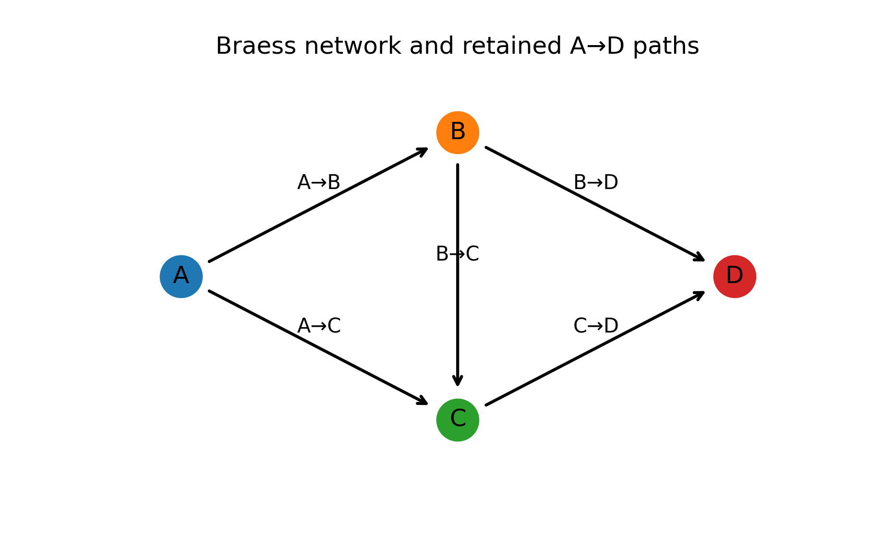
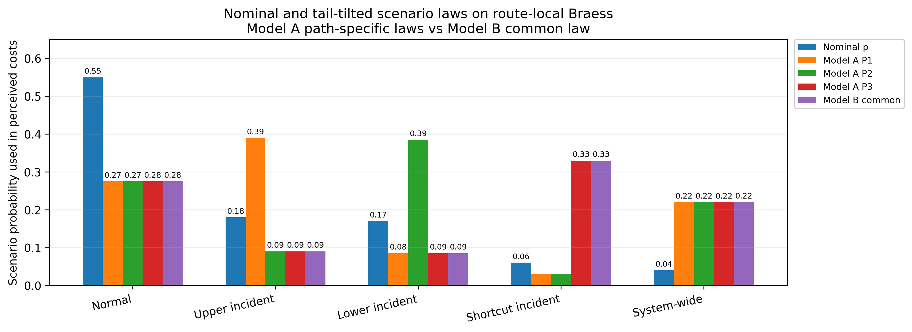

# Risk-Averse Stochastic User Equilibrium on Uncertain Transportation Networks

Research code, benchmark data, and computational outputs accompanying the manuscript **“Risk-Averse Stochastic User Equilibrium on Uncertain Transportation Networks.”**

**Authors:** Wencheng Bao, Chrysafis Vogiatzis, and Eleftheria Kontou  
**Affiliation:** University of Illinois Urbana-Champaign

This repository develops and tests a risk- and ambiguity-aware **truncated stochastic user equilibrium (TSUE)** framework for transportation networks subject to uncertain supply-side disruptions. The implementation combines endogenous active-path selection, mean–CVaR risk sensitivity, common-tail equivalence diagnostics, and 1-Wasserstein distributionally robust optimization.

<p align="center">
  
  
</p>

## Overview

The repository implements the following components:

- **Truncated route choice:** the active route set is determined endogenously within a prespecified candidate path set through the OD-specific reservation generalized cost.
- **Model A:** a path-based mean–CVaR TSUE formulated as a variational inequality. Each path can have its own tail-tilted scenario law.
- **Model B:** a potential-based mean–CVaR TSUE using one common tail-tilted scenario law across all paths and OD pairs. With the entropy regularizer, the optimization problem is strictly convex and has a unique path-flow solution.
- **Common-tail diagnostics:** numerical tests of conditions under which Model A and Model B produce identical perceived costs and equilibrium flows.
- **Wasserstein DRO:** a distributionally robust extension of Model B in which a worst-case law is selected within a 1-Wasserstein ambiguity set and then tail-tilted by CVaR.
- **Computational studies:** mechanism experiments on the Braess network and full-network experiments on the Sioux Falls benchmark.

The code is configured for the manuscript-scale experiments through:

```python
RUN_PROFILE = "paper"
```

## Repository structure

```text
.
├── Braess/
│   ├── 00_network_setup_and_core_truncation.py
│   ├── 01_direct_eta_risk_sensitivity_with_A_and_B_flows.py
│   ├── 02_lambda_reporting_grid_alpha090_096.py
│   ├── 03_tail_tilt_model_ab_interpretation.py
│   ├── 04_common_tail_exactness_and_warm_start_direct_eta_grid_iteration_only.py
│   ├── 05_route_overlap_iia_diagnostic_complete.py
│   ├── 06_wasserstein_dro_reliable_bc_upgrade_FIXED_SELECTED_LAW_RUN_ALL.py
│   ├── 07_regime_conditioned_ambiguity_vri_alpha096_eta040_WITH_CONDITIONAL_TESTS.py
│   └── braess_*_outputs/
│
├── Sioux Fall/
│   ├── SiouxFalls_net.tntp
│   ├── SiouxFalls_net.txt
│   ├── SiouxFalls_node.tntp
│   ├── SiouxFalls_node.txt
│   ├── SiouxFalls_trips.tntp
│   ├── SiouxFalls_trips.txt
│   ├── sioux_falls_edge_scenario_modifications.csv
│   ├── sioux_falls_full_od_modelAB_ModelB_RU_convex.py
│   └── sioux_falls_full_od_modelAB_ModelB_RU_frontier_DRO.py
│
└── README.md
```

The committed output directories contain manuscript tables, diagnostic CSV files, and publication-resolution figures. The files associated with the optional lambda-reporting and regime-conditioned analyses are retained as supplementary computational material even when those sections are not included in the current manuscript version.

## Script guide

### Braess experiments

| Script | Purpose |
|---|---|
| `00_network_setup_and_core_truncation_clean.py` | Builds the route-local Braess instance and demonstrates the core truncated-choice mechanism. |
| `01_direct_eta_risk_sensitivity_with_A_and_B_flows_clean.py` | Solves Model A and Model B over the direct \((\alpha,\eta)\) risk grid. |
| `02_lambda_reporting_grid_alpha090_096_clean.py` | Generates the optional lambda-mapped reporting grid. |
| `03_tail_tilt_model_ab_interpretation_clean.py` | Compares route-specific and common tail-tilted scenario laws. |
| `04_common_tail_exactness_and_warm_start_direct_eta_grid_iteration_only_clean.py` | Tests common-tail exactness and Model B warm starts for Model A. |
| `05_route_overlap_iia_diagnostic_complete_clean.py` | Performs candidate-set duplication and route-overlap sensitivity diagnostics. |
| `06_wasserstein_dro_reliable_bc_upgrade_FIXED_SELECTED_LAW_RUN_ALL_clean.py` | Runs finite-support Wasserstein DRO and the reliable \(B\to C\) upgrade experiment. |
| `07_regime_conditioned_ambiguity_vri_alpha096_eta040_WITH_CONDITIONAL_TESTS_clean.py` | Runs the supplementary regime-conditioned ambiguity and value-of-information experiment. |

### Sioux Falls experiments

| Script | Purpose |
|---|---|
| `sioux_falls_full_od_modelAB_ModelB_RU_convex.py` | Builds the full-OD Sioux Falls instance, generates candidate paths and scenarios, solves scenario-conditioned TSUE, Model A, and convex Model B, and produces common-tail diagnostics. |
| `sioux_falls_full_od_modelAB_ModelB_RU_frontier_DRO.py` | Extends the full-network experiment with the risk frontier, train–test validation, Wasserstein DRO diagnostics, and exchange/Benders-style computations. |

## Requirements

The scripts require **Python 3.10 or newer**.

Install the Python dependencies with:

```bash
python3 -m pip install --upgrade pip
python3 -m pip install numpy pandas scipy matplotlib networkx ipython
```

The committed implementations use SciPy-based numerical optimization and do not require a commercial solver.

For a clean environment:

```bash
git clone https://github.com/bwc021600/Risk-Averse-Stochastic-User-Equilibrium-on-Uncertain-Transportation-Networks.git
cd Risk-Averse-Stochastic-User-Equilibrium-on-Uncertain-Transportation-Networks

python3 -m venv .venv
source .venv/bin/activate

python3 -m pip install --upgrade pip
python3 -m pip install numpy pandas scipy matplotlib networkx ipython
```

## Running the Braess experiments

Each Braess script is standalone. Run a specific experiment from the repository root:

```bash
python3 "Braess/00_network_setup_and_core_truncation_clean.py"
```

To run the complete numbered sequence on macOS or Linux:

```bash
cd Braess

for script in 0{0..7}_*.py; do
    python3 "$script"
done
```

The full sequence can be computationally expensive, particularly the Wasserstein DRO and regime-conditioned experiments. Run individual scripts when only one table or figure needs to be reproduced.

## Running the Sioux Falls experiments

The Sioux Falls scripts should be run from the `Sioux Fall` directory or from any directory with the input locations supplied through environment variables.

### Convex Model A–Model B experiment

```bash
cd "Sioux Fall"
python3 sioux_falls_full_od_modelAB_ModelB_RU_convex.py
```

### Risk frontier and Wasserstein DRO experiment

```bash
cd "Sioux Fall"
python3 sioux_falls_full_od_modelAB_ModelB_RU_frontier_DRO.py
```

The frontier/DRO script is the more computationally intensive of the two and may require substantial runtime.

## Sioux Falls input files

The required files are:

```text
SiouxFalls_net.tntp
SiouxFalls_trips.tntp
SiouxFalls_node.tntp
```

Equivalent `.txt` files are also accepted. A reference assignment file is optional:

```text
SiouxFalls_flow.tntp
```

When provided, the reference-flow file is used for reference plots and related diagnostics. Its absence does not prevent the main equilibrium experiments from running.

The current file resolver searches:

1. the directory containing the Python script;
2. the directory specified by `SIOUX_INPUT_DIR`;
3. the current working directory.

It also accepts browser-generated duplicate names such as `SiouxFalls_net(1).tntp`, although the standard filenames are recommended for reproducibility.

The following environment variables can override the default locations:

```text
SIOUX_INPUT_DIR
SIOUX_NET_FILE
SIOUX_TRIPS_FILE
SIOUX_NODE_FILE
SIOUX_FLOW_FILE
SIOUX_OUTPUT_DIR
```

Example:

```bash
export SIOUX_INPUT_DIR="/absolute/path/to/Sioux Fall"
export SIOUX_OUTPUT_DIR="/absolute/path/to/results"

python3 "Sioux Fall/sioux_falls_full_od_modelAB_ModelB_RU_convex.py"
```

## Sioux Falls scenario data

The complete edge-level scenario parameterization is available here:

[`Sioux Fall/sioux_falls_edge_scenario_modifications.csv`](Sioux%20Fall/sioux_falls_edge_scenario_modifications.csv)

The file contains all \(76\times6=456\) scenario–link combinations for the following joint full-network states:

| Scenario | Probability |
|---|---:|
| Normal | 0.550 |
| Light rain | 0.200 |
| Minor incident | 0.150 |
| Flood upper | 0.040 |
| Flood middle | 0.035 |
| Flood lower | 0.025 |

The CSV fields are:

```text
scenario
probability
link_id
init_node
term_node
severity_h
capacity_multiplier
free_time_multiplier
b_multiplier
additive_delay
time_at_reference_flow_change_pct
```

These probabilities represent complete network states, not independent link-level event probabilities.

## Output files

Depending on the script, the generated artifacts include:

- equilibrium path-flow and link-flow tables;
- Model A–Model B distance and VI-gap diagnostics;
- CVaR selectors and tail-tilted scenario laws;
- active-set and reservation-cost summaries;
- solver iteration and runtime tables;
- scenario-conditioned TSUE results;
- risk-frontier and train–test validation tables;
- worst-case Wasserstein probability laws;
- 600-dpi PNG figures and selected PDF figures;
- ZIP archives of generated outputs.

Rerunning a script can overwrite files in its corresponding output directory. Preserve a copy of any output set used for a manuscript revision or archived release.

## Reproducibility notes

- Random seeds are specified in the scripts where sampling is used.
- Flows and capacities in the Sioux Falls implementation are scaled by \(1000\); one numerical unit represents \(1000\) vehicles per hour.
- The default entropy reference-flow scale is \(r_0=1\) under the scaled-flow convention.
- The Sioux Falls candidate set retains up to five shortest simple paths per positive-demand OD pair, subject to the configured free-flow-time ratio threshold.
- Numerical results may differ slightly across Python, SciPy, BLAS, operating-system, and processor versions because the experiments use nonlinear optimization and convergence tolerances.
- The committed result tables should be treated as the reference outputs associated with the current repository version.
- For a paper or archival citation, use a tagged release or an immutable commit SHA rather than a moving `main`-branch URL.

## Relationship to the manuscript

The computational files support the principal mechanisms studied in the manuscript:

1. endogenous route activation through OD demand-conservation multipliers;
2. route-specific mean–CVaR state weighting in Model A;
3. common-state mean–CVaR weighting and convexity in Model B;
4. common-tail conditions under which Models A and B coincide;
5. candidate-set duplication and route-overlap sensitivity;
6. Wasserstein ambiguity and robust route evaluation;
7. reliability-oriented network improvement decisions;
8. full-network validation on the Sioux Falls benchmark.

The Braess experiments isolate model mechanisms on a small network. The Sioux Falls experiments evaluate the same mechanisms on a 24-node, 76-directed-link benchmark with full positive OD demand.

## Citation

The manuscript is currently represented as a working paper. Until journal or DOI information is available, the repository may be cited as:

```bibtex
@misc{bao2026riskaverse,
  title={Risk-Averse Stochastic User Equilibrium on Uncertain Transportation Networks}, 
  author={Bao, Wencheng and Vogiatzis, Chrysafis and Kontou, Eleftheria},
  year={2026},
  eprint={2603.20207},
  archivePrefix={arXiv},
  primaryClass={math.OC},
  doi={10.48550/arXiv.2603.20207},
  url={https://arxiv.org/abs/2603.20207}
}
```

Replace this entry with the final journal citation and DOI when available.

## License

A project license has not yet been added. Until a `LICENSE` file is included, the code, data, and computational outputs should be treated as all rights reserved. Please contact the authors before redistribution or reuse beyond normal scholarly citation.

## Questions and reproducibility reports

For errors, missing files, or reproducibility questions, open a GitHub issue and include:

- the script name;
- the Python and SciPy versions;
- the operating system;
- the complete error message;
- the input filenames and working directory;
- the final solver status or convergence diagnostics, when applicable.
